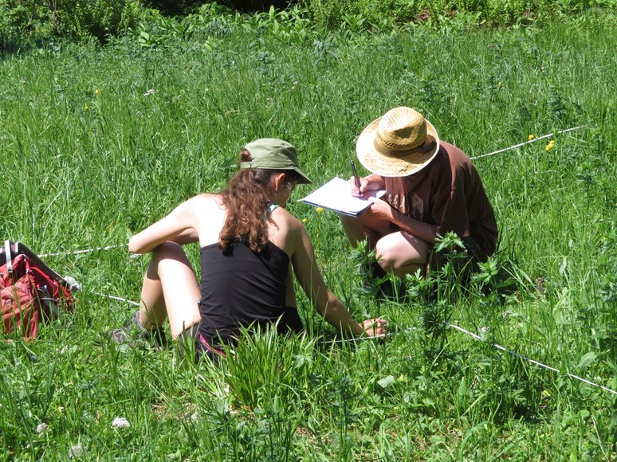
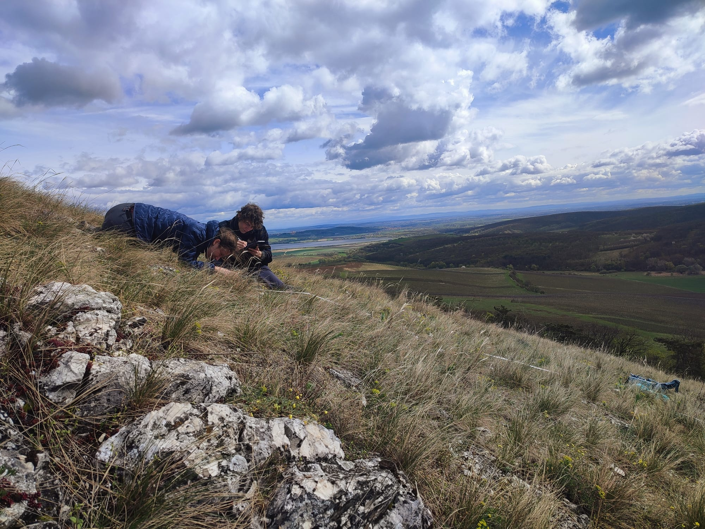

::: {layout-ncol="2"}
### 💻 Software

-   **R:** Professional user (data manipulation, statistical analysis, work with spatial data, visualisation including shiny applications)
-   **Python:** Basics for data manipulation
-   **Bash:** Basics necessary for working with HPC
-   **LaTeX:** Familiar with document preparation
-   **Reproducibility:** Git/GitHub, Quarto, RMarkdown, Zenodo
-   **GIS:** QGIS, ArcGIS, QField
-   **Vegetation ecology software:** Turboveg 2, JUICE
-   **Office:** MS Office, Google Workspace
-   **Literature management:** Zotero

### 📈 Statistics

-   **Univariate:** LMs, GLMs, GAMs, Mixed-Effects Models
-   **Multivariate:** Ordination, classification, diversity analyses (`vegan` R package)
-   **Bayesian:** Occupancy models (JAGS, `spOccupancy` R package)
:::

### 🌱 Fieldwork experience

```{r}
#| eval: false
#| echo: false
#| message: false
#| warning: false
library(leaflet)

leaflet() |> 
  addProviderTiles(providers$Stadia.Outdoors)  |> 
  addAwesomeMarkers(lng = 17.2380767, lat = 50.0553339, popup =
  paste0(
  "<div style='min-width: 150px; font-family: sans-serif;'>",
    "<h4 style='margin: 0 0 5px 0; font-size: 13px; font-weight: bold;'>Subalpine vegetation in the Eastern Sudetes</h4>",
    "",
    "<a href='https://doi.org/10.1111/avsc.12711' target='_blank' style='background-color: #2255A1; color: white; padding: 5px 10px; text-decoration: none; border-radius: 3px; font-size: 12px;'>",
    "📄 Read Publication</a>",
  "</div>"
), 
                    icon = awesomeIcons(icon = 'circle', iconColor = '#FFFFFF', library = 'fa', markerColor = 'lightgray')) |> 
  addAwesomeMarkers(lng = 16.7019942, lat = 48.7764950, popup =
                      paste0(
  "<div style='min-width: 150px; font-family: sans-serif;'>",
    "<h4 style='margin: 0 0 5px 0; font-size: 13px; font-weight: bold;'>Halophytic vegetation in southern Moravia and Lower Austria</h4>",
    "",
    "<a href='https://doi.org/10.23855/preslia.2022.013' target='_blank' style='background-color: #2255A1; color: white; padding: 5px 10px; text-decoration: none; border-radius: 3px; font-size: 12px;'>",
    "📄 Read Publication</a>",
  "</div>"
), 
                    icon = awesomeIcons(icon = "circle", iconColor = '#FFFFFF', library = "fa", markerColor = 'lightblue')) |> 
  addAwesomeMarkers(lng = 16.646433, lat = 48.8680831, popup = 
                      paste0(
  "<div style='min-width: 150px; font-family: sans-serif;'>",
    "<h4 style='margin: 0 0 5px 0; font-size: 13px; font-weight: bold;'>Phenological sampling of steppe vegetation in the South Moravia</h4>",
    "",
  "</div>"
),  icon = awesomeIcons(icon = "circle", iconColor = '#FFFFFF', library = "fa", markerColor = 'orange')) |> 
  addAwesomeMarkers(lng = 17.1597635, lat = 49.1538649, popup = 
                      paste0(
  "<div style='min-width: 150px; font-family: sans-serif;'>",
    "<h4 style='margin: 0 0 5px 0; font-size: 13px; font-weight: bold;'>Semi-dry grasslands in Central Moravian Carpathians</h4>",
    "",
    "<a href='https://doi.org/10.1007/s10531-023-02740-6' target='_blank' style='background-color: #2255A1; color: white; padding: 5px 10px; text-decoration: none; border-radius: 3px; font-size: 12px;'>",
    "📄 Read Publication</a>",
  "</div>"
), 
             icon = awesomeIcons(icon = "circle", iconColor = '#FFFFFF', library = "fa", markerColor = 'orange')) |>
  addAwesomeMarkers(lng = 16.9739678, lat = 48.9643804, popup = paste0(
  "<div style='min-width: 150px; font-family: sans-serif;'>",
    "<h4 style='margin: 0 0 5px 0; font-size: 13px; font-weight: bold;'>Tall-herb vegetation of the South Moravian forest-steppe</h4>",
    "",
    "<a href='https://doi.org/10.1007/s11756-023-01464-w' target='_blank' style='background-color: #2255A1; color: white; padding: 5px 10px; text-decoration: none; border-radius: 3px; font-size: 12px;'>",
    "📄 Read Publication</a>",
  "</div>"
), 
             icon = awesomeIcons(icon = "circle", iconColor = '#FFFFFF', library = "fa", markerColor = 'purple')) |>
  addAwesomeMarkers(lng = 16.94513, lat = 48.55459, popup = paste0(
  "<div style='min-width: 150px; font-family: sans-serif;'>",
    "<h4 style='margin: 0 0 5px 0; font-size: 13px; font-weight: bold;'>Sand vegetation in the Vienna Basin (Austria, Slovakia, Czech Republic)</h4>",
    "",
    "<a href='https://doi.org/10.23855/preslia.2025.613' target='_blank' style='background-color: #2255A1; color: white; padding: 5px 10px; text-decoration: none; border-radius: 3px; font-size: 12px;'>",
    "📄 Read Publication</a>",
  "</div>"
), 
             icon = awesomeIcons(icon = "circle", iconColor = '#FFFFFF', library = "fa", markerColor = 'beige')) |>
  addAwesomeMarkers(lng = 19.0166540, lat = 42.9060400, popup =
                      paste0(
  "<div style='min-width: 150px; font-family: sans-serif;'>",
    "<h4 style='margin: 0 0 5px 0; font-size: 13px; font-weight: bold;'>Forest vegetation of Montenegro</h4>",
    "",
  "</div>"
), 
             icon = awesomeIcons(icon = "circle", iconColor = '#FFFFFF', library = "fa", markerColor = 'darkgreen')) |> 
  addAwesomeMarkers(lng = 20.0072916, lat = 44.0951833, popup =
                      paste0(
  "<div style='min-width: 150px; font-family: sans-serif;'>",
    "<h4 style='margin: 0 0 5px 0; font-size: 13px; font-weight: bold;'>Forest vegetation of Serbia</h4>",
    "",
  "</div>"
), 
             icon = awesomeIcons(icon = "circle", iconColor = '#FFFFFF', library = "fa", markerColor = 'darkgreen')) |> 
  addAwesomeMarkers(lng = 20.0646518, lat = 43.2433714, popup = 
                      paste0(
  "<div style='min-width: 150px; font-family: sans-serif;'>",
    "<h4 style='margin: 0 0 5px 0; font-size: 13px; font-weight: bold;'>Species-rich meadows in the Balkan penninsula</h4>",
    "",
  "</div>"), 
             icon = awesomeIcons(icon = "circle", iconColor = '#FFFFFF', library = "fa", markerColor = 'pink')) |> 
  addAwesomeMarkers(lng = 13.8750830, lat = 46.177, popup = 
                      paste0(
  "<div style='min-width: 150px; font-family: sans-serif;'>",
    "<h4 style='margin: 0 0 5px 0; font-size: 13px; font-weight: bold;'>Species richness hotspots in Slovenia</h4>",
    "",
  "</div>"
), 
             icon = awesomeIcons(icon = "circle", iconColor = '#FFFFFF', library = "fa", markerColor = 'darkgreen'))
```

::: {layout-ncol="3"}
{group="fieldwork" description="**Main outcome**: Danihelka, J., Chytrý, K., Harásek, M., Hubatka, P., **Klinkovská, K.**, Kratoš, F., Kučerová, A., Slachová, K., Szokala, D., Prokešová, H., Šmerdová, E., Večeřa, M. & Chytrý, M. (2022). *Halophytic flora and vegetation in southern Moravia and northern Lower Austria: past and present.* **Preslia** 94: 13-110. [](https://doi.org/10.23855/preslia.2022.013) – Data: [](https://doi.org/10.5281/zenodo.4624798)"}

{group="fieldwork" description="**Main outcome**: **Klinkovská, K.**, Kučerová, A., Pustková, Š., Rohel, J., Slachová, K., Sobotka, V., Szokala, D., Danihelka, J., Kočí, M., Šmerdová, E. & Chytrý, M. (2023). *Subalpine vegetation changes in the East Sudetes (1973–2021): effects of abandonment, avalanches and conservation management.* **Applied Vegetation Science** 26: e12711. [](https://doi.org/10.1111/avsc.12711) – Data: [](https://doi.org/10.5281/zenodo.7338814)"}

{group="fieldwork" description="**Main outcome**: **Klinkovská, K.** & Roleček, J. (2023). *Floristic classification of* Geranion sanguinei *in South Moravia (Czech Republic).* **Biologia** 79: 1113–1127. [](https://doi.org/10.1007/s11756-023-01464-w)"}

{group="fieldwork" description="**Main outcome**: **Klinkovská, K.**, Sperandii, M. G., Trávníček, B. & Chytrý, M. (2024). *Significant decline in habitat specialists in semi-dry grasslands over four decades.* **Biodiversity and Conservation** 33: 161–178. [](https://doi.org/10.1007/s10531-023-02740-6) – Data and code: [](https://doi.org/10.5281/zenodo.10060598)"}

{group="fieldwork"}

{group="fieldwork" description="**Main outcome**: **Friesová, K.**, Axmanová, I., Borovyk, D., Ćuk, M., Kopčan, B., Valachovič, M., Clark, A. T. & Chytrý, M. (2025). *Vegetation remains, specialist species fade: changes in Pannonian sand grasslands.* **Preslia** 97: 613–635. [](https://doi.org/10.23855/preslia.2025.613) – Data and code: [](https://doi.org/10.5281/zenodo.16258179)"}

{group="fieldwork" description="**Main outcome**: **Friesová, K.**, Pustková, Š., Hubatka, P., Janišová, N., Nejeschlebová, K., Rohel, J., Sobotka, V., Šmerdová, E., Večeřa, M., Kadaš, D., Kopčan, B., Krejčová, M., Kučerová, A., Axmanová, I., Dřevojan, P., Janišová, M., Nikolei, R., Szokala, D., Stanišić-Vujačić, M., Stešević, D., Danihelka, J. & Chytrý, M. (2026). *Forest herb-layer species richness in the western Balkan diversity hotspot.* **Journal of Vegetation Science** 37: e70167. [](https://doi.org/10.1111/jvs.70167) – Data and code: [](https://doi.org/10.5281/zenodo.21453602)"}

{group="\"fieldwork"}

{group="fieldwork"}

{group="fieldwork"}
:::

