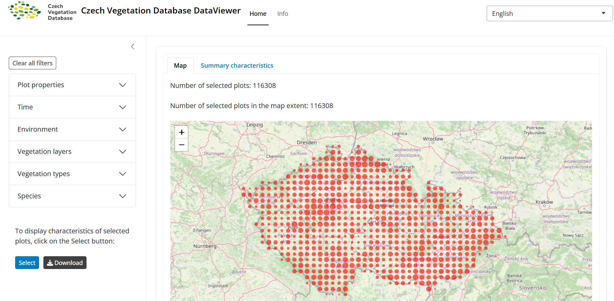

The [EVA-FAIR](https://oscars-project.eu/projects/eva-fair-implementing-fair-principles-european-vegetation-archive-data) (Implementing FAIR principles in the European Vegetation Archive data) project is funded within the Open Science Clusters’ Action for Research and Society ([OSCARS](https://oscars-project.eu/)) Horizon Europe project under grant agreement No. 101129751. The EVA-FAIR project aims to implement FAIR principles across European vegetation-plot databases. These databases store plant occurrence and abundance records collected across the continent over the past century. Such plots are the primary source of information on plant diversity in natural and anthropogenic habitats, and on changes in plant diversity over time. EVA, the European Vegetation Archive, currently contains more than 2 million vegetation plots with approximately 50 million plant occurrence records.

The goal of the project is to move EVA data towards open access by publishing them in trusted, FAIR-compliant repositories, such as Zenodo.

By advancing open science practices, the project supports researchers, conservationists, and citizen scientists across Europe, enabling comprehensive analyses of biodiversity changes over time.

::: {.callout-tip appearance="simple" icon="false"}
## My role

Within this project, I contributed to the development of a website presenting the Czech Vegetation Database: <https://czechveg.github.io> and created a data viewer, that provides maps and summary characteristics of selected vegetation plots: <https://vegscibrno.shinyapps.io/czechveg>.

:::
